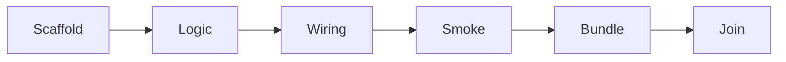

# Hedgehog DeepSeek Harness Core ⭐

### Plugins That Don't Break When DSH Moves

DeepSeek Harness moves fast and pre-1.0 APIs shift underneath you. A
plugin built freehand today can be broken by next week's release.

This core builds DSH plugins against a pinned, tested version, through
the same six-layer discipline every Hedgehog build uses — so a plugin
ships working, and stays working.



## What you get

- **A pinned DSH/Cordis workspace**, tested against an exact release
  tag instead of a moving caret range.
- **A tool-plugin generator**, so plugin boilerplate is generated, not
  handwritten.
- **Friction logging built in** — undocumented behavior and breaking
  changes get recorded as you build, not lost to a Slack thread.

## Built for real DSH plugin work

Reach for this core when you're building a tool, hook, or extension for
an existing DeepSeek Harness installation via its plugin/bundle system.

## Easy to install and use

Ask your agent:
*"Install Hedgehog and build me a DSH plugin for [what it should do]"*

<details>
<summary>For your agent</summary>

```
npx @skyf0xx/hedgehog init
```

Hedgehog's planner selects this core automatically when the project
targets DeepSeek Harness or Cordis. You can also request it directly:

```
npx @skyf0xx/hedgehog init --deepseek-harness
```

Technical details: [ARCHITECTURE.md](ARCHITECTURE.md)
